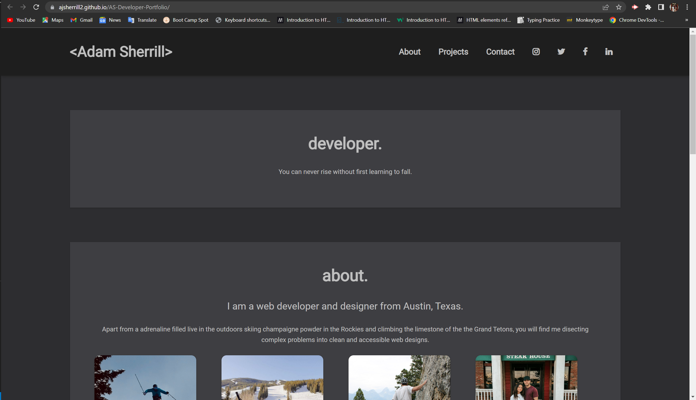
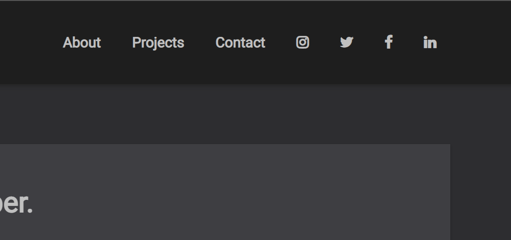
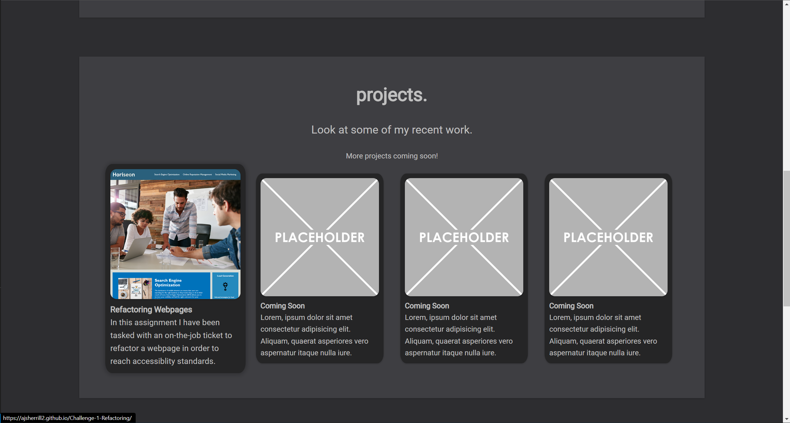
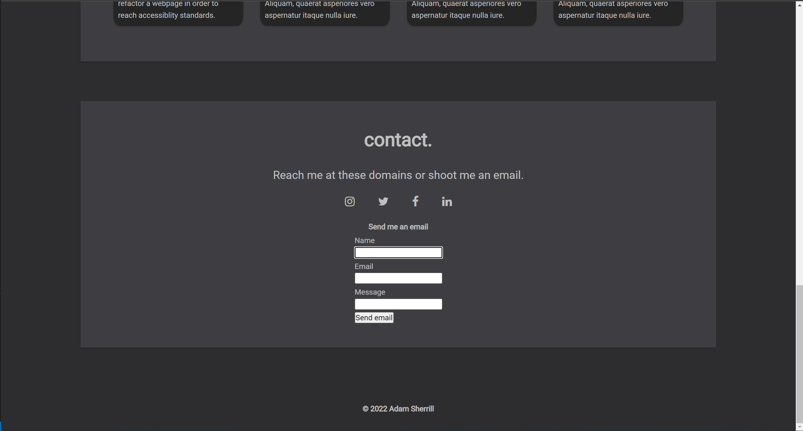

# <Web-Developer-Portfolio>

## Description

In this project I was tasked  with creating a personal web developer portfolio, something that looked clean but also responsive to provide a catelog of my work and projects for employers to view. In this project I learned the importance of flexbox design and became more intune with styling in CSS as a whole.

## Table of Contents (Optional)

If your README is long, add a table of contents to make it easy for users to find what they need.

- [Installation](#installation)
- [Usage](#usage)
- [Credits](#credits)

## Installation

The first steps towards installing my project where to write up a wireframe, in my case I used pencil and paper since I already had a great idea for my layout. 

Now I must create a safe repository to save my files to. Using the terminal and GitHub I can create a commit all changes to my live repository. I will do this as often as I can throughout the entire project.

After i had some heading to my idea the next appropriate step was to create a detailed semantic HTML. In this case I have a head followed by a body and within this body are semantic tags including a header with a navbar, a main section with multiple sub sections to represent pages within the HTML and lastly a footer to close off my webpage.

The HTML is not completely finished at this point but it then becomes important to add a link to a CSS file where I implement styles to elements, classes, and ID's.

I have now gotten my web page to look pretty but only on a desktop screen, it is also important to have a resposive design. I achieved this by using flexbox containers, percentages, rem, and media queries.

## Usage

You can find my webpage at https://ajsherrill2.github.io/AS-Developer-Portfolio/

Once iside the webpage the user will see a header with a navigation bar to the right, by clicking on any of the links the UI scrolls to the corrsponding section, social media links will take you to the web developers respective medias.

once the users is at the projects section by hovering the cursor over each project that specific projects grows to be more readable, plus clicking on each project brings the user to a seperate tab of the deployed application.

Below the previous section the user will find a contact form that allows the user to send an email with there name and email and a message.

## Credits

Hex code theme:
https://www.color-hex.com/color-palette/98179

Social Media icons:
https://cdnjs.cloudflare.com/ajax/libs/font-awesome/4.7.0/css/font-awesome.min.css

Tutorials:

https://www.youtube.com/watch?v=vQAvjof1oe4

https://www.youtube.com/watch?v=FEmysQARWFU&t=1141s

https://www.youtube.com/watch?v=r4RQ38EoLds